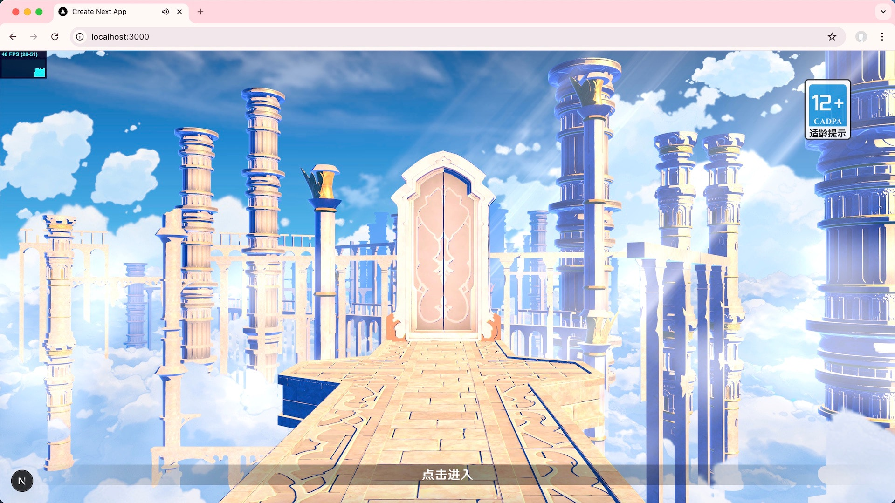

# 魔改Threejs版《原神》登录界面



## 原作者

本项目基于 [@https://www.bilibili.com/video/BV1E8411v7xy](https://www.bilibili.com/video/BV1E8411v7xy) 的作品进行魔改与重构，感谢原作者的精彩创作与分享！

## 技术细节

1. Threejs 到 react-three-fiber 的重构，实现更现代化的组件化开发。
2. 增加了第一人称视角，提升沉浸式体验。
3. 对 shader 进行了调整与优化，兼容性与视觉效果增强。
4. 云层实现摄像机跟随。

## About Shaders

ThreeJS Shader源码地址: 
https://github.com/mrdoob/three.js/blob/181e04eea8b569dc09048f9dc644310ed6b745a6/src/renderers/shaders/ShaderChunk/lights_fragment_begin.glsl.js

版本原因，原作者的shader源码有部分调整。这里自己花了不少时间踩坑。比如
lights_fragment_beginToon，建议先用本地threejs版本的shader源码lights_fragment_begin.glsl.js替换掉，在做增量修改。
下面是部分版本差异：
```
GeometricContext geometry;
geometry.position = - vViewPosition;
geometry.normal = normal;
geometry.viewDir = ( isOrthographic ) ? vec3( 0, 0, 1 ) : normalize( vViewPosition );
#ifdef USE_CLEARCOAT
    geometry.clearcoatNormal = clearcoatNormal;
#endif
```
调整为下面方式。参考官方源码：lights_fragment_begin.glsl.js
```
vec3 geometryPosition = - vViewPosition;
vec3 geometryNormal = normal;
vec3 geometryViewDir = ( isOrthographic ) ? vec3( 0, 0, 1 ) : normalize( vViewPosition );
vec3 geometryClearcoatNormal;
```


